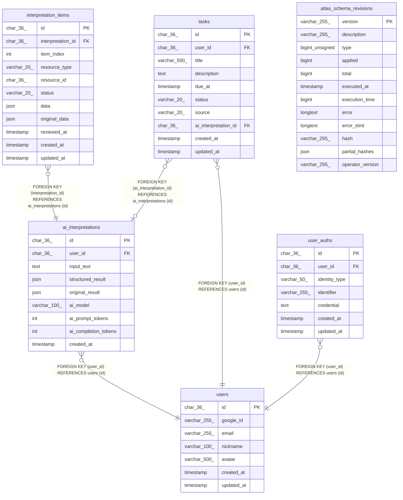

# ai_chat_task

## Tables

| Name | Columns | Comment | Type |
| ---- | ------- | ------- | ---- |
| [ai_interpretations](ai_interpretations.md) | 9 | AI解析履歴 | BASE TABLE |
| [atlas_schema_revisions](atlas_schema_revisions.md) | 12 |  | BASE TABLE |
| [interpretation_items](interpretation_items.md) | 11 | AI解釈アイテム（レビュー対象） | BASE TABLE |
| [tasks](tasks.md) | 10 | タスク | BASE TABLE |
| [user_auths](user_auths.md) | 7 | ユーザー認証情報 | BASE TABLE |
| [users](users.md) | 7 | ユーザー | BASE TABLE |

## Relations

---

> Generated by [tbls](https://github.com/k1LoW/tbls)
