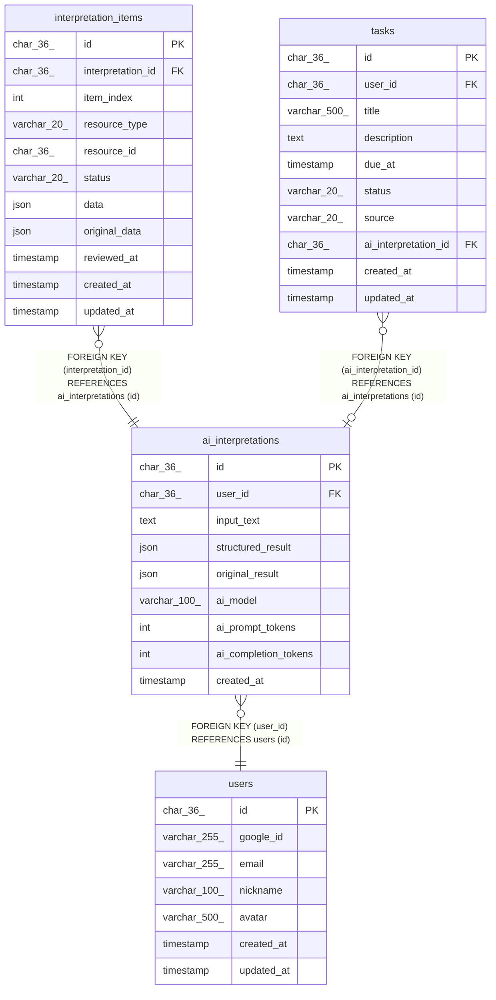

# ai_interpretations

## Description

AI解析履歴

<details>
<summary><strong>Table Definition</strong></summary>

```sql
CREATE TABLE `ai_interpretations` (
  `id` char(36) COLLATE utf8mb4_unicode_ci NOT NULL COMMENT 'AI解釈ID (UUID)',
  `user_id` char(36) COLLATE utf8mb4_unicode_ci NOT NULL COMMENT 'ユーザーID',
  `input_text` text COLLATE utf8mb4_unicode_ci NOT NULL COMMENT 'ユーザーが入力した自然言語テキスト',
  `structured_result` json NOT NULL COMMENT 'AI解析結果のJSON構造',
  `original_result` json DEFAULT NULL COMMENT 'AI提案の原本（レビュー前）',
  `ai_model` varchar(100) COLLATE utf8mb4_unicode_ci NOT NULL DEFAULT 'gemini-flash' COMMENT '使用AIモデル名',
  `ai_prompt_tokens` int DEFAULT NULL COMMENT '入力トークン数',
  `ai_completion_tokens` int DEFAULT NULL COMMENT '出力トークン数',
  `created_at` timestamp NOT NULL DEFAULT CURRENT_TIMESTAMP COMMENT '解析実行日時',
  PRIMARY KEY (`id`),
  KEY `idx_ai_interpretations_user_created` (`user_id`,`created_at` DESC),
  KEY `idx_ai_interpretations_type` ((cast(json_unquote(json_extract(`structured_result`,_utf8mb4'$.type')) as char(50) charset utf8mb4))),
  CONSTRAINT `fk_ai_interpretations_user` FOREIGN KEY (`user_id`) REFERENCES `users` (`id`) ON DELETE CASCADE
) ENGINE=InnoDB DEFAULT CHARSET=utf8mb4 COLLATE=utf8mb4_unicode_ci COMMENT='AI解析履歴'
```

</details>

## Columns

| Name | Type | Default | Nullable | Extra Definition | Children | Parents | Comment |
| ---- | ---- | ------- | -------- | ---------------- | -------- | ------- | ------- |
| id | char(36) |  | false |  | [interpretation_items](interpretation_items.md) [tasks](tasks.md) |  | AI解釈ID (UUID) |
| user_id | char(36) |  | false |  |  | [users](users.md) | ユーザーID |
| input_text | text |  | false |  |  |  | ユーザーが入力した自然言語テキスト |
| structured_result | json |  | false |  |  |  | AI解析結果のJSON構造 |
| original_result | json |  | true |  |  |  | AI提案の原本（レビュー前） |
| ai_model | varchar(100) | gemini-flash | false |  |  |  | 使用AIモデル名 |
| ai_prompt_tokens | int |  | true |  |  |  | 入力トークン数 |
| ai_completion_tokens | int |  | true |  |  |  | 出力トークン数 |
| created_at | timestamp | CURRENT_TIMESTAMP | false | DEFAULT_GENERATED |  |  | 解析実行日時 |

## Constraints

| Name | Type | Definition |
| ---- | ---- | ---------- |
| fk_ai_interpretations_user | FOREIGN KEY | FOREIGN KEY (user_id) REFERENCES users (id) |
| PRIMARY | PRIMARY KEY | PRIMARY KEY (id) |

## Indexes

| Name | Definition |
| ---- | ---------- |
| idx_ai_interpretations_user_created | KEY idx_ai_interpretations_user_created (user_id, created_at) USING BTREE |
| PRIMARY | PRIMARY KEY (id) USING BTREE |

## Relations



---

> Generated by [tbls](https://github.com/k1LoW/tbls)
