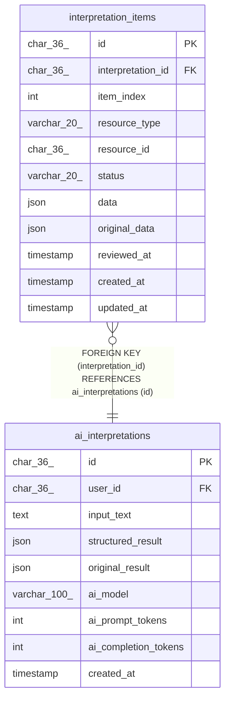

# interpretation_items

## Description

AI解釈アイテム（レビュー対象）

<details>
<summary><strong>Table Definition</strong></summary>

```sql
CREATE TABLE `interpretation_items` (
  `id` char(36) COLLATE utf8mb4_unicode_ci NOT NULL COMMENT 'アイテムID (UUID)',
  `interpretation_id` char(36) COLLATE utf8mb4_unicode_ci NOT NULL COMMENT 'AI解釈ID',
  `item_index` int NOT NULL COMMENT '結果内のindex',
  `resource_type` varchar(20) COLLATE utf8mb4_unicode_ci NOT NULL COMMENT 'リソースタイプ (task/event/wallet)',
  `resource_id` char(36) COLLATE utf8mb4_unicode_ci DEFAULT NULL COMMENT '作成済みリソースID',
  `status` varchar(20) COLLATE utf8mb4_unicode_ci NOT NULL DEFAULT 'pending' COMMENT 'ステータス (pending/created)',
  `data` json NOT NULL COMMENT '編集後のアイテム内容',
  `original_data` json NOT NULL COMMENT 'AI提案の原本',
  `reviewed_at` timestamp NULL DEFAULT NULL COMMENT 'レビュー日時',
  `created_at` timestamp NOT NULL DEFAULT CURRENT_TIMESTAMP COMMENT '作成日時',
  `updated_at` timestamp NOT NULL DEFAULT CURRENT_TIMESTAMP ON UPDATE CURRENT_TIMESTAMP COMMENT '更新日時',
  PRIMARY KEY (`id`),
  KEY `idx_interpretation_items_interpretation` (`interpretation_id`,`item_index`),
  KEY `idx_interpretation_items_resource` (`resource_type`,`resource_id`),
  KEY `idx_interpretation_items_status` (`interpretation_id`,`status`),
  CONSTRAINT `fk_interpretation_items_interpretation` FOREIGN KEY (`interpretation_id`) REFERENCES `ai_interpretations` (`id`) ON DELETE CASCADE,
  CONSTRAINT `chk_interpretation_items_resource_type` CHECK ((`resource_type` in (_utf8mb4'task',_utf8mb4'event',_utf8mb4'wallet'))),
  CONSTRAINT `chk_interpretation_items_status` CHECK ((`status` in (_utf8mb4'pending',_utf8mb4'created')))
) ENGINE=InnoDB DEFAULT CHARSET=utf8mb4 COLLATE=utf8mb4_unicode_ci COMMENT='AI解釈アイテム（レビュー対象）'
```

</details>

## Columns

| Name | Type | Default | Nullable | Extra Definition | Children | Parents | Comment |
| ---- | ---- | ------- | -------- | ---------------- | -------- | ------- | ------- |
| id | char(36) |  | false |  |  |  | アイテムID (UUID) |
| interpretation_id | char(36) |  | false |  |  | [ai_interpretations](ai_interpretations.md) | AI解釈ID |
| item_index | int |  | false |  |  |  | 結果内のindex |
| resource_type | varchar(20) |  | false |  |  |  | リソースタイプ (task/event/wallet) |
| resource_id | char(36) |  | true |  |  |  | 作成済みリソースID |
| status | varchar(20) | pending | false |  |  |  | ステータス (pending/created) |
| data | json |  | false |  |  |  | 編集後のアイテム内容 |
| original_data | json |  | false |  |  |  | AI提案の原本 |
| reviewed_at | timestamp |  | true |  |  |  | レビュー日時 |
| created_at | timestamp | CURRENT_TIMESTAMP | false | DEFAULT_GENERATED |  |  | 作成日時 |
| updated_at | timestamp | CURRENT_TIMESTAMP | false | DEFAULT_GENERATED on update CURRENT_TIMESTAMP |  |  | 更新日時 |

## Constraints

| Name | Type | Definition |
| ---- | ---- | ---------- |
| fk_interpretation_items_interpretation | FOREIGN KEY | FOREIGN KEY (interpretation_id) REFERENCES ai_interpretations (id) |
| PRIMARY | PRIMARY KEY | PRIMARY KEY (id) |
| chk_interpretation_items_resource_type | CHECK | CHECK ((`resource_type` in (_utf8mb4\'task\',_utf8mb4\'event\',_utf8mb4\'wallet\'))) |
| chk_interpretation_items_status | CHECK | CHECK ((`status` in (_utf8mb4\'pending\',_utf8mb4\'created\'))) |

## Indexes

| Name | Definition |
| ---- | ---------- |
| idx_interpretation_items_interpretation | KEY idx_interpretation_items_interpretation (interpretation_id, item_index) USING BTREE |
| idx_interpretation_items_resource | KEY idx_interpretation_items_resource (resource_type, resource_id) USING BTREE |
| idx_interpretation_items_status | KEY idx_interpretation_items_status (interpretation_id, status) USING BTREE |
| PRIMARY | PRIMARY KEY (id) USING BTREE |

## Relations



---

> Generated by [tbls](https://github.com/k1LoW/tbls)
