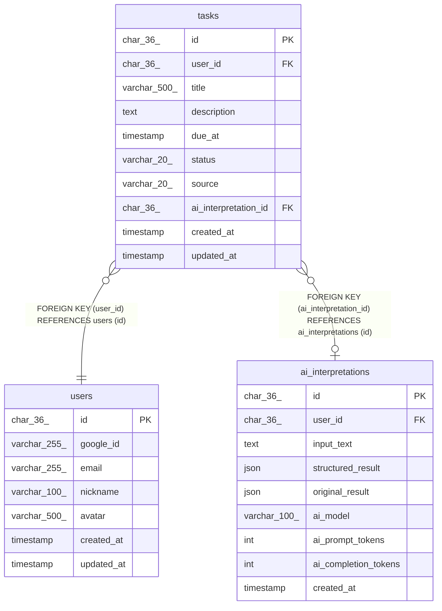

# tasks

## Description

タスク

<details>
<summary><strong>Table Definition</strong></summary>

```sql
CREATE TABLE `tasks` (
  `id` char(36) COLLATE utf8mb4_unicode_ci NOT NULL COMMENT 'タスクID (UUID)',
  `user_id` char(36) COLLATE utf8mb4_unicode_ci NOT NULL COMMENT 'ユーザーID',
  `title` varchar(500) COLLATE utf8mb4_unicode_ci NOT NULL COMMENT 'タスクタイトル',
  `description` text COLLATE utf8mb4_unicode_ci COMMENT 'タスク詳細',
  `due_at` timestamp NULL DEFAULT NULL COMMENT '期限日時',
  `status` varchar(20) COLLATE utf8mb4_unicode_ci NOT NULL DEFAULT 'todo' COMMENT 'ステータス（todo/in_progress/done）',
  `source` varchar(20) COLLATE utf8mb4_unicode_ci NOT NULL DEFAULT 'manual' COMMENT '作成元',
  `ai_interpretation_id` char(36) COLLATE utf8mb4_unicode_ci DEFAULT NULL COMMENT '元のAI解釈ID',
  `created_at` timestamp NOT NULL DEFAULT CURRENT_TIMESTAMP COMMENT '作成日時',
  `updated_at` timestamp NOT NULL DEFAULT CURRENT_TIMESTAMP ON UPDATE CURRENT_TIMESTAMP COMMENT '更新日時',
  PRIMARY KEY (`id`),
  KEY `idx_tasks_created_at` (`created_at`),
  KEY `idx_tasks_due_at` (`due_at`),
  KEY `idx_tasks_status` (`status`),
  KEY `idx_tasks_user_due` (`user_id`,`due_at`),
  KEY `idx_tasks_user_status` (`user_id`,`status`),
  KEY `idx_tasks_user_created` (`user_id`,`created_at` DESC),
  KEY `fk_tasks_ai_interpretation` (`ai_interpretation_id`),
  CONSTRAINT `fk_tasks_ai_interpretation` FOREIGN KEY (`ai_interpretation_id`) REFERENCES `ai_interpretations` (`id`) ON DELETE SET NULL,
  CONSTRAINT `fk_tasks_user` FOREIGN KEY (`user_id`) REFERENCES `users` (`id`) ON DELETE CASCADE,
  CONSTRAINT `chk_tasks_source` CHECK ((`source` in (_utf8mb4'ai',_utf8mb4'manual'))),
  CONSTRAINT `chk_tasks_status` CHECK ((`status` in (_utf8mb4'todo',_utf8mb4'in_progress',_utf8mb4'done')))
) ENGINE=InnoDB DEFAULT CHARSET=utf8mb4 COLLATE=utf8mb4_unicode_ci COMMENT='タスク'
```

</details>

## Columns

| Name | Type | Default | Nullable | Extra Definition | Children | Parents | Comment |
| ---- | ---- | ------- | -------- | ---------------- | -------- | ------- | ------- |
| id | char(36) |  | false |  |  |  | タスクID (UUID) |
| user_id | char(36) |  | false |  |  | [users](users.md) | ユーザーID |
| title | varchar(500) |  | false |  |  |  | タスクタイトル |
| description | text |  | true |  |  |  | タスク詳細 |
| due_at | timestamp |  | true |  |  |  | 期限日時 |
| status | varchar(20) | todo | false |  |  |  | ステータス（todo/in_progress/done） |
| source | varchar(20) | manual | false |  |  |  | 作成元 |
| ai_interpretation_id | char(36) |  | true |  |  | [ai_interpretations](ai_interpretations.md) | 元のAI解釈ID |
| created_at | timestamp | CURRENT_TIMESTAMP | false | DEFAULT_GENERATED |  |  | 作成日時 |
| updated_at | timestamp | CURRENT_TIMESTAMP | false | DEFAULT_GENERATED on update CURRENT_TIMESTAMP |  |  | 更新日時 |

## Constraints

| Name | Type | Definition |
| ---- | ---- | ---------- |
| fk_tasks_ai_interpretation | FOREIGN KEY | FOREIGN KEY (ai_interpretation_id) REFERENCES ai_interpretations (id) |
| fk_tasks_user | FOREIGN KEY | FOREIGN KEY (user_id) REFERENCES users (id) |
| PRIMARY | PRIMARY KEY | PRIMARY KEY (id) |
| chk_tasks_source | CHECK | CHECK ((`source` in (_utf8mb4\'ai\',_utf8mb4\'manual\'))) |
| chk_tasks_status | CHECK | CHECK ((`status` in (_utf8mb4\'todo\',_utf8mb4\'in_progress\',_utf8mb4\'done\'))) |

## Indexes

| Name | Definition |
| ---- | ---------- |
| fk_tasks_ai_interpretation | KEY fk_tasks_ai_interpretation (ai_interpretation_id) USING BTREE |
| idx_tasks_created_at | KEY idx_tasks_created_at (created_at) USING BTREE |
| idx_tasks_due_at | KEY idx_tasks_due_at (due_at) USING BTREE |
| idx_tasks_status | KEY idx_tasks_status (status) USING BTREE |
| idx_tasks_user_created | KEY idx_tasks_user_created (user_id, created_at) USING BTREE |
| idx_tasks_user_due | KEY idx_tasks_user_due (user_id, due_at) USING BTREE |
| idx_tasks_user_status | KEY idx_tasks_user_status (user_id, status) USING BTREE |
| PRIMARY | PRIMARY KEY (id) USING BTREE |

## Relations



---

> Generated by [tbls](https://github.com/k1LoW/tbls)
