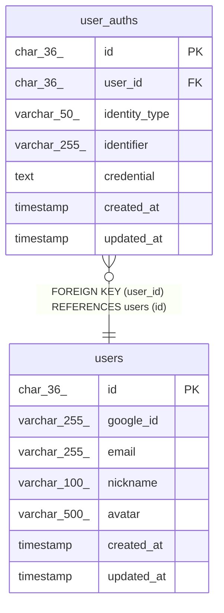

# user_auths

## Description

ユーザー認証情報

<details>
<summary><strong>Table Definition</strong></summary>

```sql
CREATE TABLE `user_auths` (
  `id` char(36) COLLATE utf8mb4_unicode_ci NOT NULL COMMENT '認証ID (UUID)',
  `user_id` char(36) COLLATE utf8mb4_unicode_ci NOT NULL COMMENT 'ユーザーID',
  `identity_type` varchar(50) COLLATE utf8mb4_unicode_ci NOT NULL COMMENT '認証タイプ（google, email, github等）',
  `identifier` varchar(255) COLLATE utf8mb4_unicode_ci NOT NULL COMMENT '識別子（メールアドレス、ユーザー名等）',
  `credential` text COLLATE utf8mb4_unicode_ci COMMENT '認証情報（トークン、認証コード等）',
  `created_at` timestamp NOT NULL DEFAULT CURRENT_TIMESTAMP COMMENT '作成日時',
  `updated_at` timestamp NOT NULL DEFAULT CURRENT_TIMESTAMP ON UPDATE CURRENT_TIMESTAMP COMMENT '更新日時',
  PRIMARY KEY (`id`),
  UNIQUE KEY `uk_user_auths_identity` (`user_id`,`identity_type`,`identifier`),
  KEY `idx_user_auths_identifier` (`identity_type`,`identifier`),
  CONSTRAINT `fk_user_auths_user` FOREIGN KEY (`user_id`) REFERENCES `users` (`id`) ON DELETE CASCADE
) ENGINE=InnoDB DEFAULT CHARSET=utf8mb4 COLLATE=utf8mb4_unicode_ci COMMENT='ユーザー認証情報'
```

</details>

## Columns

| Name | Type | Default | Nullable | Extra Definition | Children | Parents | Comment |
| ---- | ---- | ------- | -------- | ---------------- | -------- | ------- | ------- |
| id | char(36) |  | false |  |  |  | 認証ID (UUID) |
| user_id | char(36) |  | false |  |  | [users](users.md) | ユーザーID |
| identity_type | varchar(50) |  | false |  |  |  | 認証タイプ（google, email, github等） |
| identifier | varchar(255) |  | false |  |  |  | 識別子（メールアドレス、ユーザー名等） |
| credential | text |  | true |  |  |  | 認証情報（トークン、認証コード等） |
| created_at | timestamp | CURRENT_TIMESTAMP | false | DEFAULT_GENERATED |  |  | 作成日時 |
| updated_at | timestamp | CURRENT_TIMESTAMP | false | DEFAULT_GENERATED on update CURRENT_TIMESTAMP |  |  | 更新日時 |

## Constraints

| Name | Type | Definition |
| ---- | ---- | ---------- |
| fk_user_auths_user | FOREIGN KEY | FOREIGN KEY (user_id) REFERENCES users (id) |
| PRIMARY | PRIMARY KEY | PRIMARY KEY (id) |
| uk_user_auths_identity | UNIQUE | UNIQUE KEY uk_user_auths_identity (user_id, identity_type, identifier) |

## Indexes

| Name | Definition |
| ---- | ---------- |
| idx_user_auths_identifier | KEY idx_user_auths_identifier (identity_type, identifier) USING BTREE |
| PRIMARY | PRIMARY KEY (id) USING BTREE |
| uk_user_auths_identity | UNIQUE KEY uk_user_auths_identity (user_id, identity_type, identifier) USING BTREE |

## Relations



---

> Generated by [tbls](https://github.com/k1LoW/tbls)
