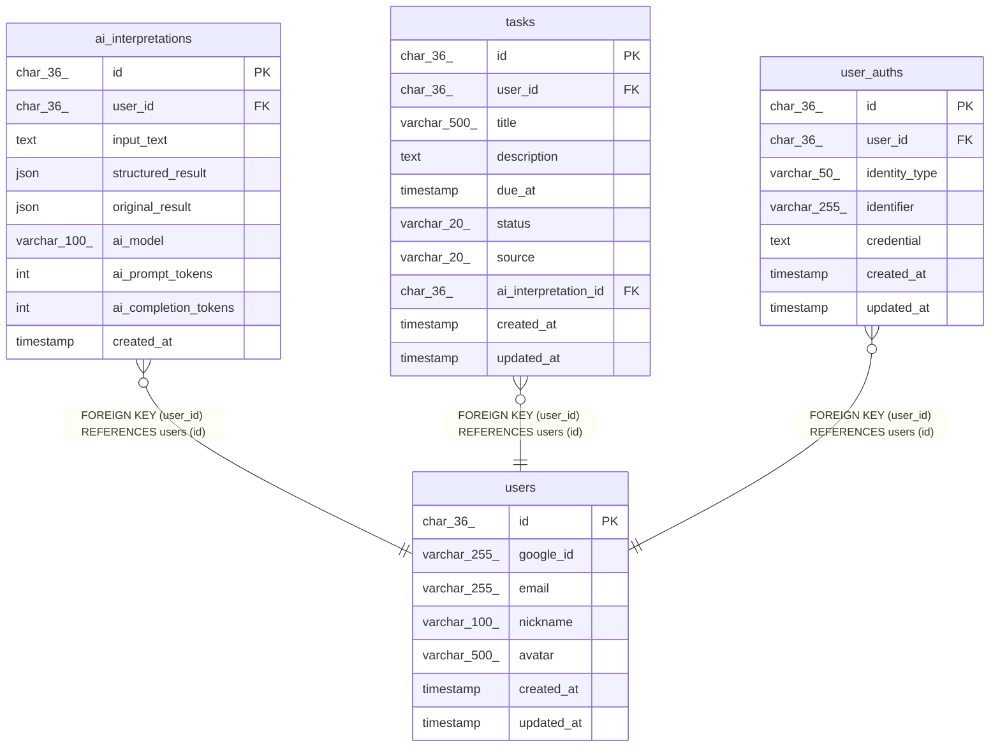

# users

## Description

ユーザー

<details>
<summary><strong>Table Definition</strong></summary>

```sql
CREATE TABLE `users` (
  `id` char(36) COLLATE utf8mb4_unicode_ci NOT NULL COMMENT 'ユーザーID (UUID)',
  `google_id` varchar(255) COLLATE utf8mb4_unicode_ci NOT NULL COMMENT 'GoogleユーザーID',
  `email` varchar(255) COLLATE utf8mb4_unicode_ci NOT NULL COMMENT 'メールアドレス',
  `nickname` varchar(100) COLLATE utf8mb4_unicode_ci NOT NULL COMMENT 'ニックネーム/表示名',
  `avatar` varchar(500) COLLATE utf8mb4_unicode_ci DEFAULT NULL COMMENT 'アバター画像URL',
  `created_at` timestamp NOT NULL DEFAULT CURRENT_TIMESTAMP COMMENT '作成日時',
  `updated_at` timestamp NOT NULL DEFAULT CURRENT_TIMESTAMP ON UPDATE CURRENT_TIMESTAMP COMMENT '更新日時',
  PRIMARY KEY (`id`),
  UNIQUE KEY `idx_users_google_id` (`google_id`),
  UNIQUE KEY `idx_users_email` (`email`),
  KEY `idx_users_created_at` (`created_at`)
) ENGINE=InnoDB DEFAULT CHARSET=utf8mb4 COLLATE=utf8mb4_unicode_ci COMMENT='ユーザー'
```

</details>

## Columns

| Name | Type | Default | Nullable | Extra Definition | Children | Parents | Comment |
| ---- | ---- | ------- | -------- | ---------------- | -------- | ------- | ------- |
| id | char(36) |  | false |  | [ai_interpretations](ai_interpretations.md) [tasks](tasks.md) [user_auths](user_auths.md) |  | ユーザーID (UUID) |
| google_id | varchar(255) |  | false |  |  |  | GoogleユーザーID |
| email | varchar(255) |  | false |  |  |  | メールアドレス |
| nickname | varchar(100) |  | false |  |  |  | ニックネーム/表示名 |
| avatar | varchar(500) |  | true |  |  |  | アバター画像URL |
| created_at | timestamp | CURRENT_TIMESTAMP | false | DEFAULT_GENERATED |  |  | 作成日時 |
| updated_at | timestamp | CURRENT_TIMESTAMP | false | DEFAULT_GENERATED on update CURRENT_TIMESTAMP |  |  | 更新日時 |

## Constraints

| Name | Type | Definition |
| ---- | ---- | ---------- |
| idx_users_email | UNIQUE | UNIQUE KEY idx_users_email (email) |
| idx_users_google_id | UNIQUE | UNIQUE KEY idx_users_google_id (google_id) |
| PRIMARY | PRIMARY KEY | PRIMARY KEY (id) |

## Indexes

| Name | Definition |
| ---- | ---------- |
| idx_users_created_at | KEY idx_users_created_at (created_at) USING BTREE |
| PRIMARY | PRIMARY KEY (id) USING BTREE |
| idx_users_email | UNIQUE KEY idx_users_email (email) USING BTREE |
| idx_users_google_id | UNIQUE KEY idx_users_google_id (google_id) USING BTREE |

## Relations



---

> Generated by [tbls](https://github.com/k1LoW/tbls)
